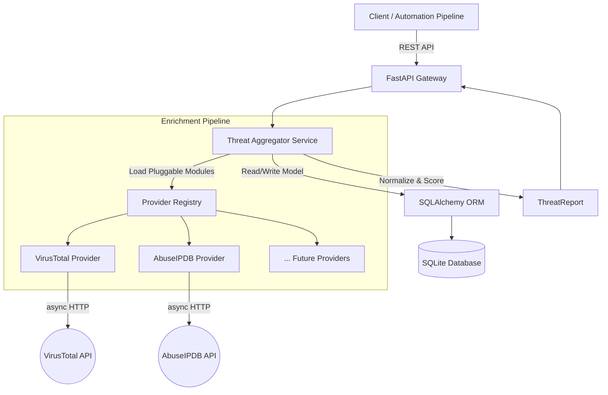
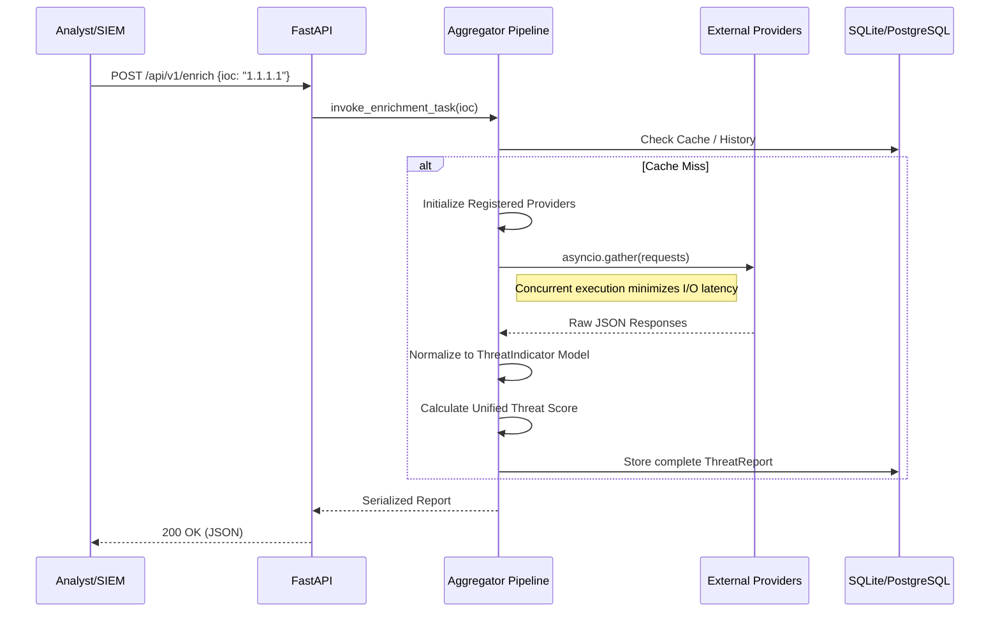

# Blackbird
> **Multi-Source Threat Intelligence Enrichment Platform**

Blackbird is an open-source threat intelligence platform designed to aggregate, normalize, correlate, and enrich Indicators of Compromise (IOCs) from multiple external intelligence providers. 

While tools like security information and event management (SIEM) systems or internal monitoring stacks track internal infrastructure state, Blackbird operates as the external context engine. It provides deterministic, programmatic enrichment of IP addresses, hashes, and domains to accelerate incident response and threat hunting workflows.

---

## Why This Project Exists

### The Problem
During an active security incident, SOC analysts and detection engineers spend critical minutes pivoting between discrete Open-Source Intelligence (OSINT) and commercial intelligence portals (e.g., VirusTotal, AbuseIPDB, AlienVault). Threat intelligence is fundamentally fragmented. Each provider uses different data models, scoring rubrics, and API structures. This manual enrichment process introduces severe latency into the incident investigation lifecycle.

### The Solution
Blackbird eliminates manual pivoting by implementing a concurrent aggregation pipeline. By utilizing a pluggable architecture, Blackbird queries multiple intelligence feeds simultaneously, normalizes their disparate JSON schemas into a strictly typed internal model, and calculates a unified threat score. This allows security automation pipelines and analysts to retrieve comprehensive context via a single API call.

---

## Architecture

Blackbird is built on a modern, asynchronous Python stack, utilizing FastAPI for high-performance API delivery and SQLAlchemy for structured data persistence. 

### Component Flow



### Execution Sequence



---

## Features

### Current Capabilities
* **FastAPI Backend:** High-performance, asynchronous REST API architecture.
* **SQLite Database & SQLAlchemy ORM:** Strict schema definition for long-term intelligence retention and querying.
* **Concurrent Collection:** Utilizing `asyncio` to eliminate I/O blocking when querying multiple upstream APIs.
* **Provider Registry Pattern:** Dynamic loading of intelligence plugins, decoupling core logic from vendor-specific implementations.
* **Threat Aggregator Service:** The core routing engine that manages task distribution and timeout handling.
* **Data Models:** Structured `ThreatIndicator` and `ThreatReport` models for deterministic downstream consumption.
* **Active Integrations:** Native support for VirusTotal and AbuseIPDB.

### Planned Features
* **Expanded Integrations:** AlienVault OTX, GreyNoise, and Shodan.
* **Vulnerability Intelligence:** Integration with the National Vulnerability Database (NVD) for CVE enrichment.
* **Storage Scalability:** Native PostgreSQL support for high-throughput, enterprise-scale deployments.
* **Data Visualization:** A React-based operational dashboard for SOC analysts.
* **Custom Scoring Engines:** Allowing organizations to define custom weightings for different threat feeds based on internal trust metrics.
* **Investigation History:** Complete audit logs of IOC evolution over time.

---

## Threat Intelligence Workflow

Blackbird enforces a strict, reproducible workflow for every ingested indicator:

`IOC` &rarr; `Enrichment` &rarr; `Correlation` &rarr; `Scoring` &rarr; `Investigation Report`

1. **IOC:** A raw artifact (IP, Domain, Hash) is submitted to the ingestion endpoint.
2. **Enrichment:** The aggregator dispatches asynchronous queries to all registered and applicable providers.
3. **Correlation:** Metadata (ASNs, associated malware families, temporal data) is extracted and mapped to a unified schema.
4. **Scoring:** Disparate confidence scores (e.g., VT's `malicious/total` vs AbuseIPDB's `confidenceScore`) are mapped to a standard 0-100 severity index.
5. **Investigation Report:** A strictly typed JSON object is returned, ready for SIEM ingestion or analyst review.

---

## Technical Deep Dive

### Provider Abstraction & Registry Pattern
To ensure the platform remains vendor-agnostic and highly extensible, Blackbird utilizes a Provider Registry pattern. All intelligence feeds inherit from an abstract base class (`BaseProvider`), which enforces a standard interface (`enrich_ioc()`, `normalize_response()`). The registry automatically discovers and instantiates these providers at runtime. Adding a new feed requires only writing a single class file, without modifying the core aggregation engine.

### Aggregation Pipeline
Due to the I/O-bound nature of API querying, Blackbird leverages Python's `asyncio.gather()`. If an analyst requests context for an IP address, Blackbird simultaneously dispatches requests to VirusTotal and AbuseIPDB. The total response time is bounded by the slowest provider, rather than the sum of all provider latencies.

### Threat Scoring
Threat scoring is subjective. Blackbird normalizes scores to provide a single baseline metric. The engine utilizes a weighted average approach, where providers can be assigned different trust weights in the configuration. The resulting metric provides a standardized severity level (Clean, Suspicious, Malicious, Critical) that downstream SOAR (Security Orchestration, Automation, and Response) platforms can use for automated triage.

---

## Repository Structure

```sh
blackbird/
├── api/
│   ├── routes/              # API endpoint definitions
│   └── dependencies.py      # FastAPI dependency injection
├── core/
│   ├── config.py            # Environment & config management
│   ├── aggregator.py        # Concurrent execution pipeline
│   └── scoring.py           # Normalization and scoring logic
├── models/
│   ├── database.py          # SQLAlchemy base and engine
│   ├── orm_models.py        # Table schemas (ThreatReport, etc.)
│   └── pydantic_models.py   # API validation schemas
├── providers/
│   ├── base.py              # BaseProvider abstract class
│   ├── registry.py          # Dynamic provider loader
│   ├── virustotal.py        # VT implementation
│   └── abuseipdb.py         # AbuseIPDB implementation
├── tests/                   # Pytest suite
├── main.py                  # Application entry point
├── requirements.txt
└── README.md
```

---

## Roadmap

**Phase 1: Core Intelligence Platform (Current)**
* [x] Establish async API architecture.
* [x] Implement Provider Registry and base abstraction.
* [x] Integrate initial OSINT sources (VT, AbuseIPDB).
* [x] Design core ORM models and SQLite persistence.

**Phase 2: Intelligence Expansion**
* [ ] Integrate AlienVault OTX and GreyNoise.
* [ ] Implement generic Webhook outputs for SOAR integration.
* [ ] Introduce PostgreSQL support for production deployments.

**Phase 3: Vulnerability Intelligence**
* [ ] Develop CVE ingestion engine.
* [ ] Integrate NVD feeds.
* [ ] Map IOCs to known exploited vulnerabilities (KEV catalog).

**Phase 4: Analyst Experience**
* [ ] Build a lightweight React frontend dashboard.
* [ ] Implement IOC investigation history and delta tracking.
* [ ] Add CSV/STIX export functionality.

**Phase 5: Open Source Ecosystem**
* [ ] Finalize Plugin Architecture SDK.
* [ ] Create public provider repository for community-contributed feeds.
* [ ] Package as a standalone Docker/Helm chart for Kubernetes deployment.

---

## Contributing

Blackbird is built by and for the security engineering community. We welcome contributions from SOC analysts, detection engineers, and developers. 

Because of the Provider Registry pattern, contributing a new threat intelligence feed is highly straightforward. You do not need to understand the entire async aggregation pipeline—simply subclass `BaseProvider`, implement the required data mapping, and submit a PR.

Please review our `CONTRIBUTING.md` for guidelines on code style, testing requirements, and architecture constraints.

---

## License

This project is licensed under the MIT License - see the [LICENSE](LICENSE) file for details.
